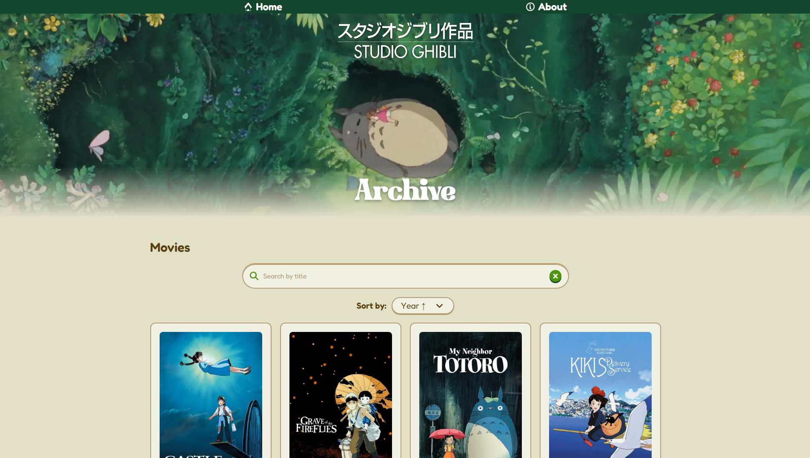
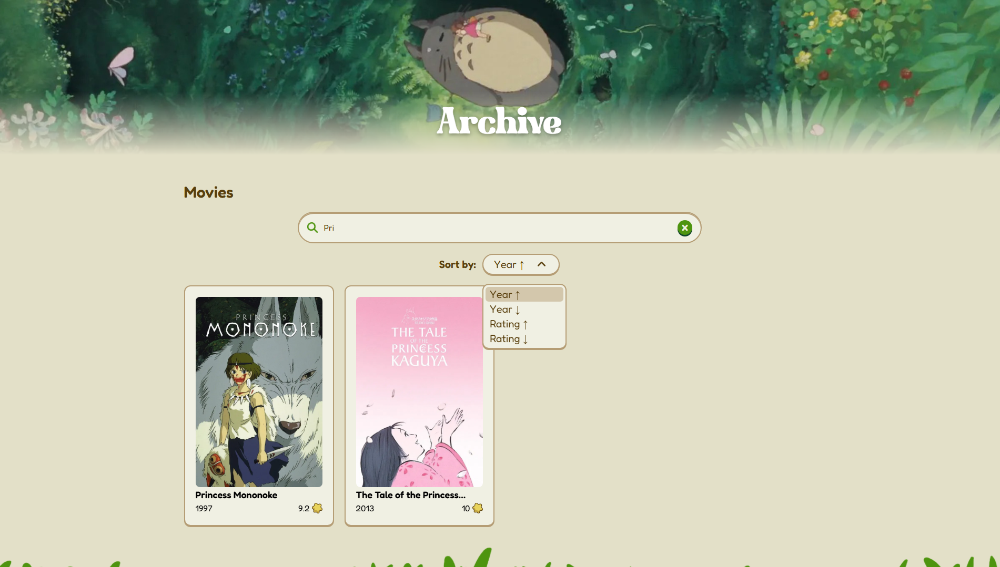
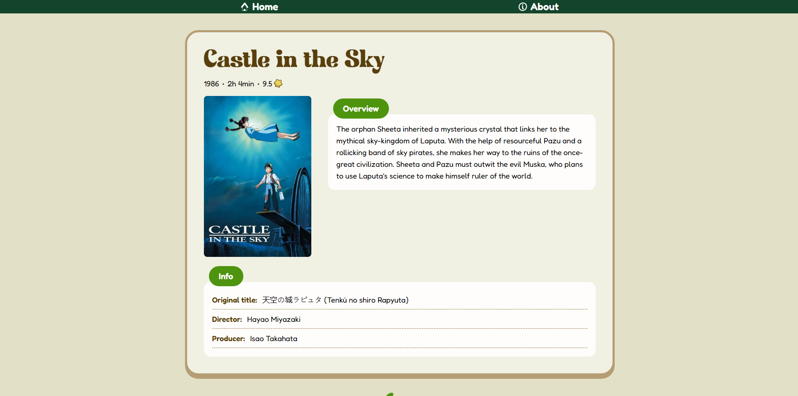

# Ghibli Archive

### 🔗 [https://mfms5.github.io/ghibliArchive/](https://mfms5.github.io/ghibliArchive/)

A small website that showcases japanese animation studio [Studio Ghibli](https://www.ghibli.jp/)'s movies, with the help of [Studio Ghibli API](https://ghibliapi.vercel.app/).

Built as a short personal project to practice front-end development with React and Tailwind CSS, among other technologies.

> Note: As of December 2025, Studio Ghibli API provides information for movies released up until 2021. In case the API's database is updated with newer movies, the Ghibli Archive website will include them automatically.

---

## Table of Contents

1. [Introduction](#introduction)
   - [Upcoming Features](#upcoming-features)
2. [Technologies Used](#technologies-used)
3. [How to Run Locally](#how-to-run-locally)
4. [Resources](#resources)

---

## 🍃 Introduction

_Ghibli Archive_ is a small website that showcases the iconic movies by japanese animation studio [Studio Ghibli](https://www.ghibli.jp/).

### Features:

- **Movie List*:* The **main page\*\* displays a grid of movie cards that show a film's poster, English title, release year and its rating score in Rotting Tomatoes.
  
- **Search and Sort**: The user can **search** a movie by title, and **sort** them by release year or rating score.
  
- **Movie Details**: Clicking on a movie card opens a new page that expands on its **details**, including an overview of the plot.
  
- **Responsive Design**: The site works seamlessly on desktop and mobile.
  

The data is obtained through HTTP requests to [Studio Ghibli API](https://ghibliapi.vercel.app/), an open-source, unofficial API that offers information about Studio Ghibli's films, its characters, locations, and others.

> Note: As of December 2025, Studio Ghibli API provides information for movies released up until 2021. In case the API's database is updated with newer movies, the Ghibli Archive website will include them automatically.

### Upcoming Features

- [ ] **Movie Filtering**: Filter movies by director, release year, and rating.
- [ ] **User Management**: Add simple login functionality to allow users to save movies to a "Watched" or "To Watch" list.

---

## 📚 Technologies Used

- [React 19](https://react.dev/).
- [Vite](https://vite.dev/) to create and build the project.
- [Tailwind CSS](https://tailwindcss.com/) for styling.
- [React Router](https://reactrouter.com/) for routing within the website.
- [Axios](https://axios-http.com) to make HTTP requests.
- [Vitest](https://vitest.dev/), [React Testing Library](https://testing-library.com/), and [Mock Service Worker](https://mswjs.io/) for testing.
- [GitHub Actions](https://github.com/features/actions) to execute a CI/CD workflow that tests the code, builds it and deploys it to a GitHub Page.
- [GitHub Pages](https://docs.github.com/en/pages) to host the website.

---

## ⚙️ How to Run Locally

_Note: Node.js is required to run this project._

1. Clone the repository and install the project's dependencies:

```bash
# Clone the repository
git clone https://github.com/mfms5/ghibliArchive

# Navigate into the project directory
cd ghibliArchive

# Install dependencies
npm install
```

2. Run project in development mode:

```bash
npm run dev
```

3. Open http://localhost:5173/ in your preferred browser.

---

## 📃 Resources

- [Studio Ghibli API](https://ghibliapi.vercel.app/).
- [Magnifying glass icon by Rutmer Zijlstra - Flaticon](https://www.flaticon.com/free-icons/magnifying-glass).
- [Home icon by Flaticon](https://www.flaticon.com/free-icon/home_146871).
- [Information icon by Rutmer Zijlstra - Flaticon](https://www.flaticon.com/free-icon/information_9675160).
- [Totoro icon by icons8](https://icons8.com/icon/IRRpeULs7luU/totoro).
- [Tailwind Animations by Midudev](https://github.com/midudev/tailwind-animations).
- [Design inspired by Matt Wierzbicki's Matsu-theme for shadcn/ui](https://matsu-theme.vercel.app/).
